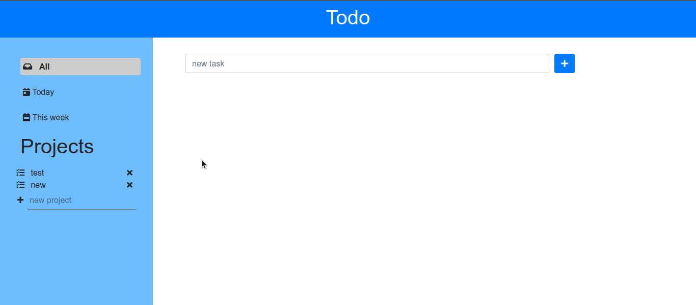

# Todo List

Todo list developed in Javascript to practice object oriented and functional programming in JavaScript.

## Table of Contents

* [About the Project](#about-the-project)
* [Built With](#built-with)
* [Live Demo](#live-demo)
* [Getting Started](#getting-started)
* [Author](#author)
* [Contributing](#contributing)
* [Show your support](#show-your-support)
* [License](#license)

## About the Project

The original specification of the project is from [The Odin Project](https://www.theodinproject.com/paths/full-stack-javascript/courses/javascript/lessons/todo-list).

The web page consists of default projects All, Today and This week. Users are also allowed to create their own projects. Projects contain different tasks which are the todos:

## Built With

* [HTML5](https://en.wikipedia.org/wiki/HTML5)
* [JavaScript](https://en.wikipedia.org/wiki/JavaScript)
* [Webpack](https://en.wikipedia.org/wiki/Webpack)

## Getting Started

To get a local copy up and running follow these simple example steps.

1. On the project GitHub page, navigate to the main page of the repository.
2. Under the repository name, locate and click on a green button named `Code`.
3. Copy the project URL as displayed.
4. If you're running the Windows Operating System, open your command prompt. On Linux, Open your terminal.
5. Change the current working directory to the location where you want the cloned directory to be made. Leave as it is if the current location is where you want the project to be.
6. Type git clone, and then paste the URL you copied in Step 3.  
e.g. $ `git clone git@github.com:HillaryOkello/Todo-list-js.git`
7. Press Enter. Your local copy will be created.

## Author

👤 **Hillary Okello**

- GitHub: [@HillaryOkello](https://github.com/HillaryOkello)
- Twitter: [@Kellyhillary4](https://twitter.com/Kellyhillary4)
- LinkedIn: [LinkedIn](https://www.linkedin.com/in/hillary-okello/)

## Contributing

Contributions, issues, and feature requests are welcome!
Feel free to check the [issues page](../../issues).

1. Clone the Project
2. Create your Feature Branch (`git checkout -b feature/AmazingFeature`)
3. Commit your Changes (`git commit -m 'Add some AmazingFeature'`)
4. Push to the Branch (`git push origin feature/AmazingFeature`)
5. Open a Pull Request

## Show your support

Give a ⭐️ if you like this project!

## License

This project is [MIT](./LICENSE) licensed.
